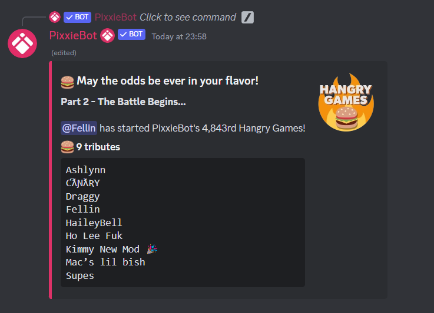

# Hangry games

## What is Hangry games?

Hangry Games is a tongue-in-cheek parody on the Hunger Games franchise, with a slightly sadistic food theme. 

Sign up to a game with your friends, volunteer as a tribute, and sit back and watch you slaughter each other with creative food themed attacks.

May the odds be ever in your flavor! 

## How to start a game?

Use `/hangrygames new` command in the channel you want to start the game, an embed will be posted for the users to join 


Want to allow others to manage all Hangry Games in your server but don't want to give them moderator permissions? Make a role called burger master and assign them.


## How to join?

Click on the Join button on the embed displayed and wait for the fun to begin!

## Hangrygames custom role

Use the command `/hangrygames role [role]` to start a game instantly including all the users in the role!


This is a premium feature, check out premium [here](https://pixx.ie)

