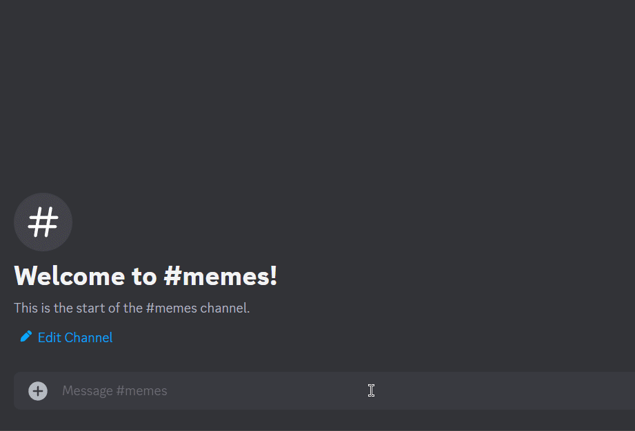

# Image-locked channels

## What is an image-locked channel?

A channel where only messages that contain an attachment (image, video, GIF etc.) are kept, and any chat is automatically and instantly deleted.

Posted attachments get default reactions automatically added to them by the bot. This is useful if you want to limit the emoji reactions people are able to use to react in order to avoid insults, emoji spamming or trolling.

## Why use image-lock in a channel?

Image-locking a channel can be useful for:
* Memes channels
* Photo contests
* Screenshot verification channels
* GIF sharing channels
* Selfies channels
* In-game media sharing

It can also increase user-engagement since the bot presents a default selection of popular reactions which makes it easier for your users to engage with the posts.

## How to use PixxieBot to image-lock a channel

### 1. Navigate to the channel you want to image-lock

This can be any text channel open to your users.

### 2. Activate image-lock

In the text channel you want to lock, use the `/imagelock on` command to instantly activate the image-lock. From now on, PixxieBot will automatically and instantly delete any messages that don't contain attachments, and auto-react to those which do.&#x20;


PixxieBot won't delete any messages sent by users who have `MANAGE_MESSAGES`, `MANAGE_GUILD` or `ADMINISTRATOR` permissions in that channel.&#x20;


## Deactivating image-lock in a channel

To deactivate image-lock and return a channel to its normal state, use `/imagelock off`. PixxieBot will immediately stop deleting chat messages that don't contain attachments and stop auto-reacting to posts.


Image-locked channels are stored in our database via channel ID. This means you can rename your channel all you want and the image-lock will continue to work. Deleting an image-locked channel or deactivating image-lock will remove the channel's ID from our database.



[Premium](https://pixx.ie/premium) servers have access to custom templates for Imagelock!


## How to use PixxieBot to create a custom template for image-lock

In any text channel, use the `/imagelock custom create <name> <emojis>` command, in the `name` parameter, enter the name of the custom template you want to set as. In the `emojis` parameter, input the emojis which are present in the server or default emojis. 

## How to enable custom image-lock template in a channel

In the text channel you want to lock, use the `/imagelock on [custom]` command, enter the custom name in `[custom]`. From now on, PixxieBot will automatically and instantly delete any messages that don't contain attachments, and auto-react to those which do.&#x20;
 