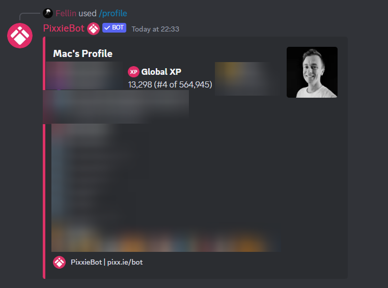

# User XP

## How is my XP calculated?

PixxieBot user XP is global XP meaning it is the same across all servers.

Every time you use a PixxieBot command, 1 XP gets added to your account.


Your position on the global XP leaderboard is listed in brackets just after your XP amount.

